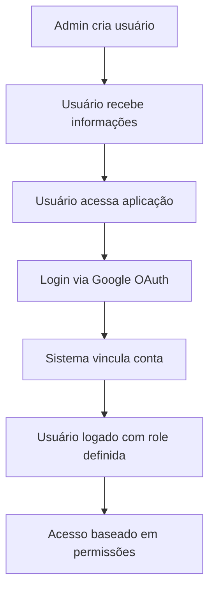

# 👥 Gestão de Usuários - Painel Administrativo

## 🎯 Nova Funcionalidade: Adicionar e Excluir Usuários

O painel administrativo agora permite que administradores criem novos usuários manualmente e gerenciem usuários existentes de forma completa.

## ✨ Funcionalidades Disponíveis

### 1. **➕ Adicionar Novos Usuários**
- Criação manual de usuários pelo administrador
- Definição de role na criação (Admin, Manager, User)
- Definição de status ativo/inativo
- Validação de email único no sistema

### 2. **🗑️ Excluir Usuários**
- Remoção permanente de usuários do sistema
- Proteção contra exclusão do próprio administrador
- Proteção contra exclusão do último administrador
- Confirmação obrigatória antes da exclusão

### 3. **🔗 Vinculação Automática via Google OAuth**
- Usuários criados manualmente podem fazer login via Google OAuth
- Vinculação automática baseada no email
- Manutenção das roles e permissões definidas pelo admin
- Atualização automática do perfil com dados do Google

## 🚀 Como Usar

### Criando um Novo Usuário

1. **Acesse o Painel Admin**
   - Faça login como administrador
   - Navegue para `/admin`

2. **Clique em "➕ Adicionar Usuário"**
   - Botão localizado no cabeçalho da seção de usuários

3. **Preencha o Formulário**
   ```
   📧 Email: usuario@empresa.com (obrigatório)
   👤 Nome: Nome Completo (obrigatório)
   🔑 Role: Admin | Manager | User
   ✅ Status: Ativo | Inativo
   ```

4. **Confirme a Criação**
   - Clique em "Criar Usuário"
   - Usuário será criado imediatamente

### Como o Usuário Faz Login Pela Primeira Vez

1. **Usuário acessa a aplicação**
   - Vai para http://localhost:3000

2. **Clica em "Login com Google"**
   - Sistema identifica o email já cadastrado
   - Vincula automaticamente a conta Google
   - Mantém role e permissões definidas pelo admin

3. **Login Futuro**
   - Usuário faz login normalmente via Google OAuth
   - Sistema reconhece a vinculação existente

### Excluindo Usuários

1. **Na lista de usuários**
   - Clique no botão "🗑️ Excluir" ao lado do usuário

2. **Confirmação**
   - Sistema solicita confirmação da exclusão
   - **Atenção**: Esta ação não pode ser desfeita

3. **Proteções Automáticas**
   - Não é possível excluir a própria conta
   - Não é possível excluir o último administrador

## 🛡️ Segurança e Validações

### Validações de Email
- ✅ Formato de email válido
- ✅ Email único no sistema
- ✅ Não permite emails duplicados

### Proteções do Sistema
- ✅ Apenas administradores podem criar/excluir usuários
- ✅ Não é possível excluir a própria conta
- ✅ Sistema mantém pelo menos um administrador ativo
- ✅ Validação de roles válidas

### Vinculação Segura
- ✅ Vinculação baseada em email verificado pelo Google
- ✅ Manutenção de permissões definidas pelo admin
- ✅ Logs de vinculação para auditoria

## 🔄 Fluxo Completo de Usuário



## 📊 Interface do Painel Admin

### Informações Exibidas
- **Foto do perfil** (após primeiro login)
- **Nome completo**
- **Email**
- **Role com badge colorido**
- **Status ativo/inativo**
- **Último login**

### Ações Disponíveis por Usuário
- 🔑 **Alterar Role**: Modificar permissões
- ⏸️ **Ativar/Desativar**: Controlar acesso
- 🗑️ **Excluir**: Remover permanentemente

### Estatísticas em Tempo Real
- Total de usuários por role
- Distribuição de status ativo/inativo
- Registros recentes (30 dias)
- Usuários ativos recentemente (7 dias)

## 💡 Casos de Uso Comuns

### 1. **Nova Contratação**
```
1. Admin cria usuário com email corporativo
2. Define role baseada no cargo (Manager/User)
3. Usuário faz primeiro login via Google OAuth
4. Sistema vincula e usuário ganha acesso
```

### 2. **Mudança de Função**
```
1. Admin acessa painel
2. Altera role do usuário (User → Manager)
3. Mudanças aplicadas no próximo login
```

### 3. **Desligamento de Funcionário**
```
1. Admin desativa usuário (mantém dados)
2. Ou exclui usuário (remove permanentemente)
3. Acesso é revogado imediatamente
```

## 🔧 Configurações Técnicas

### Estrutura do Banco de Dados
```sql
-- Coluna google_id agora permite NULL
ALTER TABLE usuarios ALTER COLUMN google_id DROP NOT NULL;

-- Permite criação manual sem Google ID
INSERT INTO usuarios (email, nome, role, ativo) 
VALUES ('user@email.com', 'Nome', 'user', true);
```

### API Endpoints
- `POST /admin/users` - Criar usuário
- `DELETE /admin/users/:id` - Excluir usuário
- `PUT /admin/users/:id/role` - Alterar role
- `PUT /admin/users/:id/status` - Alterar status

## 🎉 Benefícios

### Para Administradores
- ✅ Controle total sobre usuários do sistema
- ✅ Criação proativa de contas
- ✅ Gestão de permissões antes do primeiro acesso
- ✅ Flexibilidade na organização da equipe

### Para Usuários
- ✅ Processo de primeiro acesso simplificado
- ✅ Login familiar via Google OAuth
- ✅ Permissões já configuradas pelo admin
- ✅ Experiência de usuário consistente

### Para o Sistema
- ✅ Maior controle sobre acesso
- ✅ Melhore organização de dados
- ✅ Auditoria completa de usuários
- ✅ Escalabilidade para times maiores

---

## 🚨 Importante

- **Backup**: Sempre faça backup antes de excluir usuários
- **Comunicação**: Informe os usuários sobre o processo de primeiro login
- **Monitoramento**: Acompanhe os logs de vinculação de contas
- **Segurança**: Revise regularmente as permissões dos usuários

Para dúvidas ou suporte, consulte a documentação técnica ou entre em contato com a equipe de desenvolvimento.
